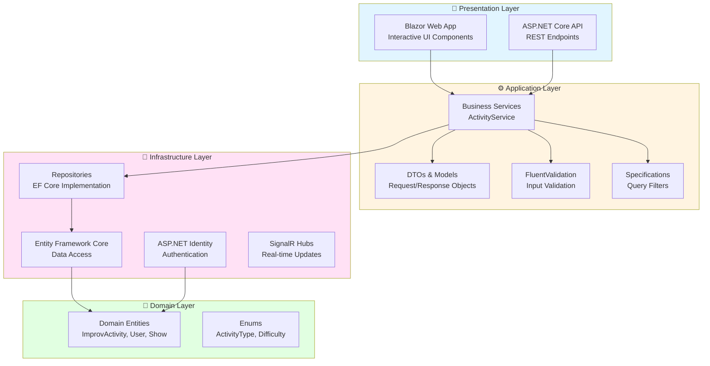
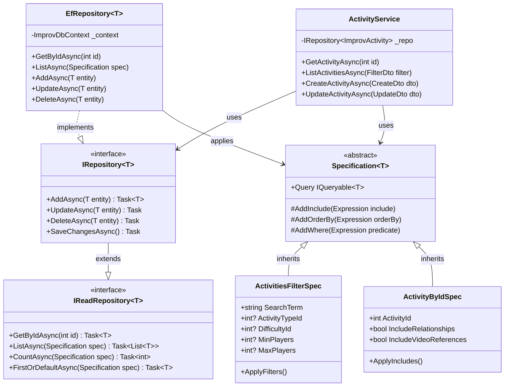
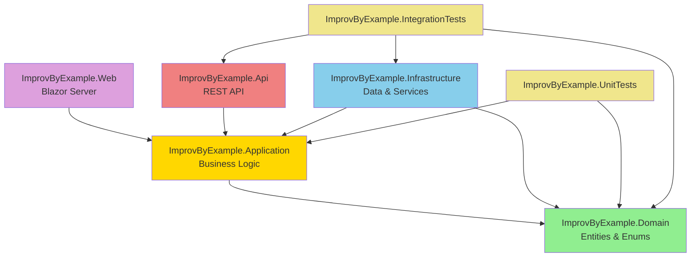

# Architecture Diagrams

## Clean Architecture Layers

This diagram shows the four-layer clean architecture implementation with dependency flow from outer to inner layers.

**Key Points:**
- Domain layer has no dependencies (pure business logic)
- Application layer depends only on Domain
- Infrastructure implements interfaces defined in Application
- Presentation depends on Application abstractions

---

## User Access Levels

This diagram illustrates the three access levels and their capabilities.

```mermaid
graph LR
    subgraph Anonymous["👤 Anonymous Users<br/>(No Login Required)"]
        Browse[📚 Browse Activities]
        Search[🔍 Search & Filter]
        View[👁️ View Details]
        Watch[🎥 Watch Videos]
        Plan[📋 Use Show Planner]
    end
    
    subgraph Authenticated["🔐 Authenticated Users<br/>(Standard Login)"]
        Login[✅ Login/Register]
        Save[💾 Save Shows]
        Favorites[⭐ Favorites<br/><i>Future Phase</i>]
        History[📜 View History<br/><i>Future Phase</i>]
    end
    
    subgraph Admin["👑 Admin Users<br/>(Full Access)"]
        Create[➕ Create Activities]
        Edit[✏️ Edit Content]
        Delete[🗑️ Delete Content]
        Generate[🎬 Generate Videos]
        Manage[📂 Manage Sources]
        Voice[🎤 Voice Input Mode]
    end
    
    Anonymous -.->|Register/Login| Authenticated
    Authenticated -.->|Admin Role| Admin
    
    style Anonymous fill:#e3f2fd
    style Authenticated fill:#f3e5f5
    style Admin fill:#fff3e0
```

**Access Level Progression:**
- Anonymous → Full read access, no account needed
- Authenticated → Personalization features (future phases)
- Admin → Full CRUD and content management

---

## Repository Pattern with Specifications

This class diagram shows the repository pattern implementation using the Specification pattern for flexible queries.

**Pattern Benefits:**
- **Separation of Concerns** - Query logic separated from data access
- **Testability** - Easy to mock repositories and test specifications
- **Reusability** - Specifications can be combined and reused
- **Flexibility** - Complex queries built through composition

---

## Component Dependencies

This diagram shows the project-level dependencies between solution components.

**Dependency Rules:**
- Domain has zero dependencies
- Application depends only on Domain
- Infrastructure implements Application interfaces
- Presentation layers depend on Application
- Tests reference what they test plus dependencies
