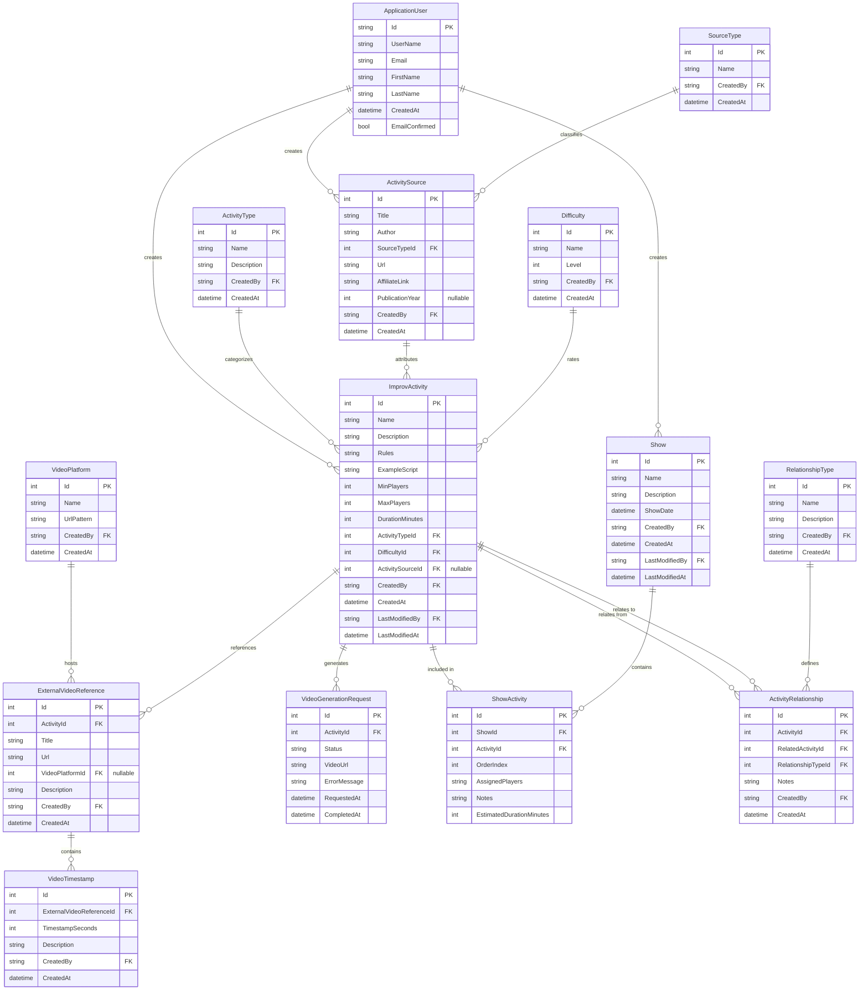

# Database Diagrams

## Entity Relationship Diagram (ERD)

This diagram shows the complete database schema with all entities and their relationships.

---

## Core Entity Relationships Detail

### Activity Ecosystem
The central entity is `ImprovActivity`, which connects to:
- **ActivityType** - Categorization (game, warmup, exercise, technique)
- **Difficulty** - Skill level rating
- **ActivitySource** - Attribution to books, workshops, or websites
- **VideoGenerationRequest** - AI-generated demonstration videos
- **ExternalVideoReference** - Links to external video examples

### Activity Relationships
Activities can relate to each other through `ActivityRelationship`:
- **Alias** - Same activity, different name
- **Variation** - Modified version of an activity
- **Similar** - Related activities with comparable mechanics

### Show Planning
The `Show` and `ShowActivity` entities enable:
- Creating performance agendas
- Ordering activities sequentially
- Assigning players to each activity
- Tracking estimated durations

### User Management
`ApplicationUser` tracks:
- Authentication via ASP.NET Identity
- Content creation/modification attribution
- Future: User preferences, favorites, history

---

## Table Relationships Summary

| Parent Entity | Child Entity | Relationship | Description |
|--------------|--------------|--------------|-------------|
| ApplicationUser | ImprovActivity | One-to-Many | User creates activities |
| ApplicationUser | ActivitySource | One-to-Many | User adds sources |
| ApplicationUser | Show | One-to-Many | User creates shows |
| ActivityType | ImprovActivity | One-to-Many | Type categorizes activities |
| Difficulty | ImprovActivity | One-to-Many | Difficulty rates activities |
| ActivitySource | ImprovActivity | One-to-Many | Source attributes activities |
| ImprovActivity | VideoGenerationRequest | One-to-Many | Activity has video generations |
| ImprovActivity | ExternalVideoReference | One-to-Many | Activity references external videos |
| ImprovActivity | ActivityRelationship | Many-to-Many | Activities relate to each other |
| ImprovActivity | ShowActivity | One-to-Many | Activity included in shows |
| ExternalVideoReference | VideoTimestamp | One-to-Many | Video has multiple timestamps |
| Show | ShowActivity | One-to-Many | Show contains ordered activities |
| RelationshipType | ActivityRelationship | One-to-Many | Type defines relationships |
| VideoPlatform | ExternalVideoReference | One-to-Many | Platform hosts videos |
| SourceType | ActivitySource | One-to-Many | Type classifies sources |
