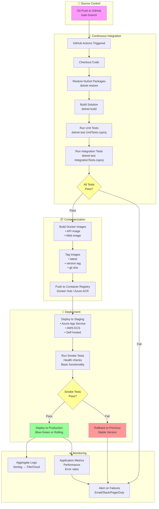
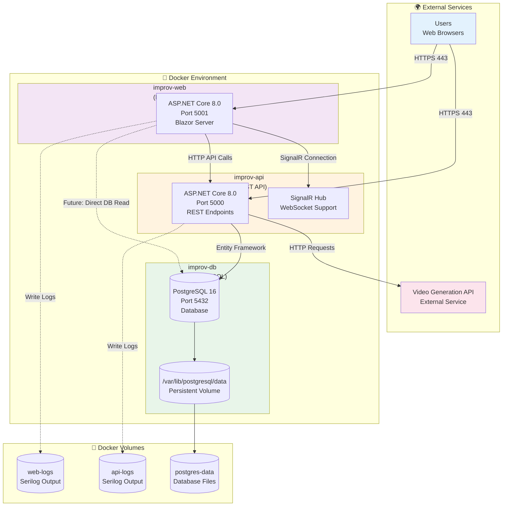
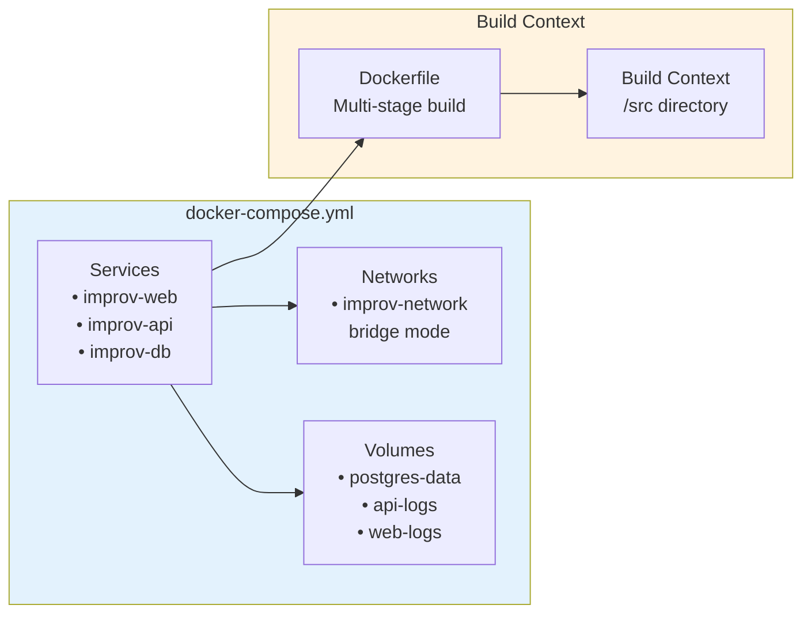
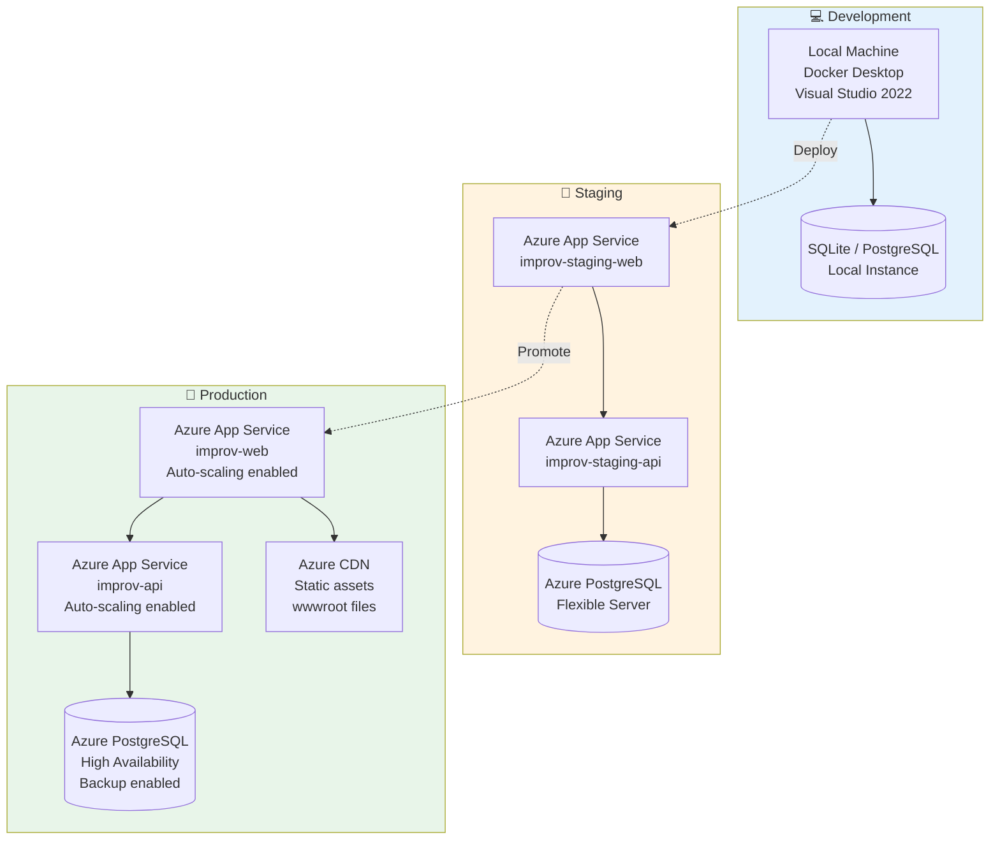
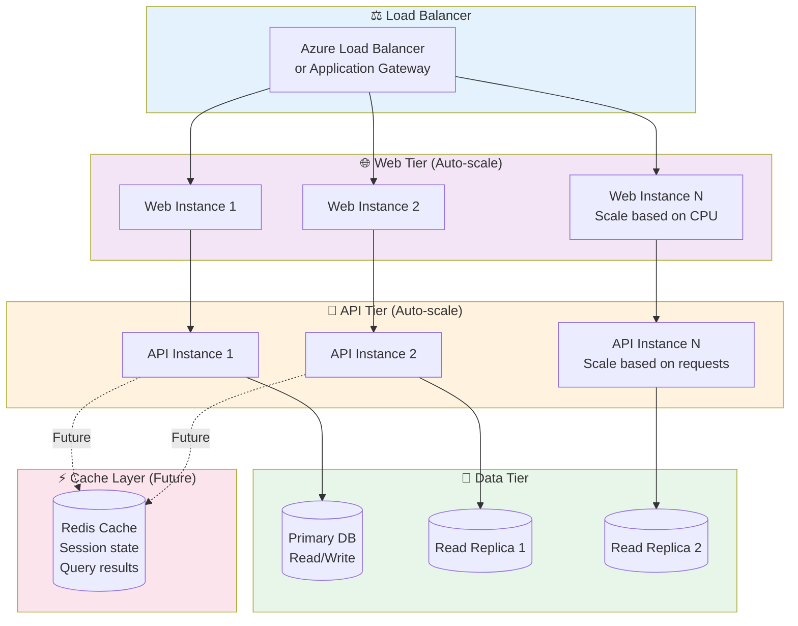

# Deployment Diagrams

## CI/CD Pipeline

This diagram illustrates the continuous integration and deployment workflow from code commit to production.



**Pipeline Stages:**

1. **Source Control**
   - Developer pushes code to GitHub
   - Triggers on `main` branch commits or pull requests

2. **Continuous Integration**
   - Restore dependencies
   - Build all projects
   - Run unit tests (fast, isolated)
   - Run integration tests (slower, database required)
   - Fail fast on any test failures

3. **Containerization**
   - Build Docker images for API and Web
   - Tag with version info (semver, git SHA)
   - Push to container registry

4. **Deployment**
   - Deploy to staging environment first
   - Run smoke tests (health endpoints, basic flows)
   - Deploy to production only if smoke tests pass
   - Support rollback on failures

5. **Monitoring**
   - Centralized logging with Serilog
   - Application performance monitoring
   - Automated alerts on errors/performance degradation

---

## Container Architecture

This diagram shows the Docker container structure and how services communicate.



**Container Details:**

### improv-web (Blazor Web App)
- **Base Image**: `mcr.microsoft.com/dotnet/aspnet:8.0`
- **Port**: 5001 (HTTPS)
- **Environment Variables**:
  - `ASPNETCORE_ENVIRONMENT`: Development/Staging/Production
  - `API_BASE_URL`: URL of improv-api container
  - `ConnectionStrings__ImprovDb`: PostgreSQL connection string
- **Volumes**:
  - `./src/ImprovByExample.Web/logs:/app/logs` - Log output
- **Dependencies**: improv-api, improv-db

### improv-api (REST API)
- **Base Image**: `mcr.microsoft.com/dotnet/aspnet:8.0`
- **Port**: 5000 (HTTP), 5001 (HTTPS)
- **Environment Variables**:
  - `ASPNETCORE_ENVIRONMENT`: Development/Staging/Production
  - `ConnectionStrings__ImprovDb`: PostgreSQL connection string
  - `VideoGeneration__ApiKey`: API key for video service
  - `VideoGeneration__Endpoint`: Video generation API endpoint
- **Volumes**:
  - `./src/ImprovByExample.Api/logs:/app/logs` - Log output
- **Dependencies**: improv-db

### improv-db (PostgreSQL)
- **Base Image**: `postgres:16`
- **Port**: 5432
- **Environment Variables**:
  - `POSTGRES_USER`: Database username
  - `POSTGRES_PASSWORD`: Database password
  - `POSTGRES_DB`: improv_db
- **Volumes**:
  - `postgres-data:/var/lib/postgresql/data` - Persistent database storage
- **Health Check**: `pg_isready -U postgres`

---

## Docker Compose Configuration



**docker-compose.yml Structure:**
```yaml
version: '3.8'

services:
  improv-db:
    image: postgres:16
    environment:
      POSTGRES_DB: improv_db
      POSTGRES_USER: improv_user
      POSTGRES_PASSWORD: ${DB_PASSWORD}
    volumes:
      - postgres-data:/var/lib/postgresql/data
    networks:
      - improv-network
    healthcheck:
      test: ["CMD-SHELL", "pg_isready -U improv_user"]
      interval: 10s
      timeout: 5s
      retries: 5

  improv-api:
    build:
      context: ./src
      dockerfile: ImprovByExample.Api/Dockerfile
    ports:
      - "5000:80"
      - "5001:443"
    environment:
      - ConnectionStrings__ImprovDb=Host=improv-db;Database=improv_db;Username=improv_user;Password=${DB_PASSWORD}
      - VideoGeneration__ApiKey=${VIDEO_API_KEY}
    volumes:
      - ./src/ImprovByExample.Api/logs:/app/logs
    depends_on:
      improv-db:
        condition: service_healthy
    networks:
      - improv-network

  improv-web:
    build:
      context: ./src
      dockerfile: ImprovByExample.Web/Dockerfile
    ports:
      - "5002:80"
    environment:
      - API_BASE_URL=http://improv-api:80
    volumes:
      - ./src/ImprovByExample.Web/logs:/app/logs
    depends_on:
      - improv-api
    networks:
      - improv-network

networks:
  improv-network:
    driver: bridge

volumes:
  postgres-data:
  api-logs:
  web-logs:
```

---

## Deployment Environments



**Environment Characteristics:**

| Environment | Purpose | Deployment | Database | Monitoring |
|-------------|---------|------------|----------|------------|
| **Development** | Local testing | Manual | Local PostgreSQL | Console logs |
| **Staging** | Pre-production validation | Automated (on merge to staging branch) | Azure PostgreSQL (smaller tier) | Application Insights |
| **Production** | Live users | Manual approval | Azure PostgreSQL (HA) | Full monitoring + alerts |

---

## Scaling Strategy



**Scaling Triggers:**
- **Web Tier**: Scale out when CPU > 70% for 5 minutes
- **API Tier**: Scale out when request queue > 100 or CPU > 70%
- **Database**: Add read replicas when read latency > 100ms
- **Cache**: Implement when query response time > 200ms consistently
