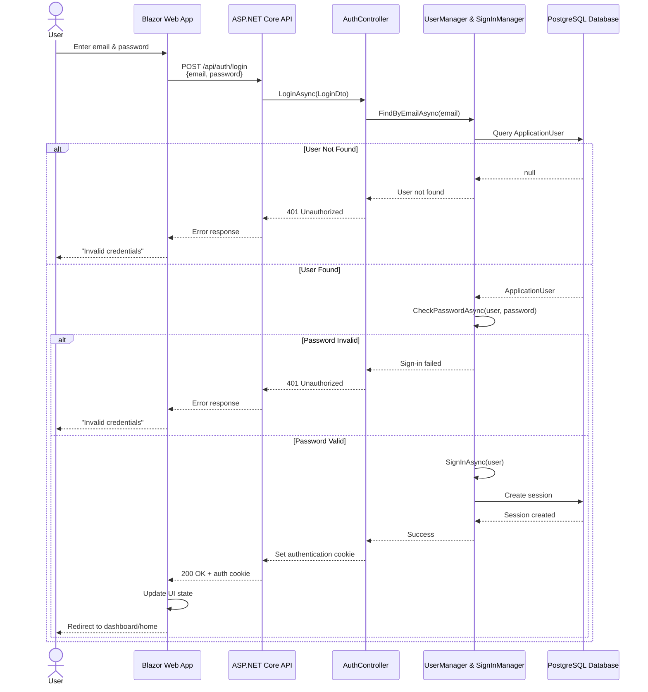
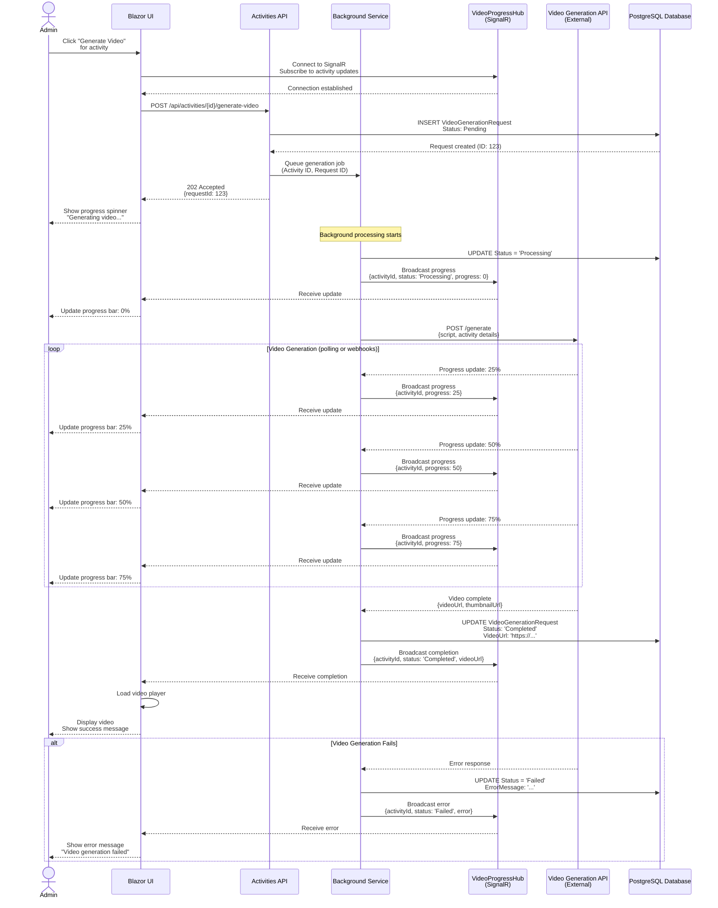
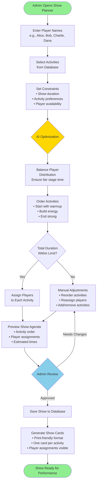
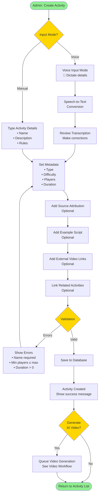

# Workflow Diagrams

## Authentication Flow

This sequence diagram shows the complete authentication process from login to session establishment.

**Key Points:**
- Cookie-based authentication (not JWT)
- Passwords hashed with ASP.NET Identity defaults
- Email used as username
- Failed attempts don't reveal whether email exists
- Session persisted server-side in database

---

## Video Generation Workflow

This sequence diagram illustrates the asynchronous video generation process with real-time progress updates via SignalR.

**Implementation Notes:**
- SignalR enables real-time updates without polling
- Background service decouples generation from API request
- Progress percentage estimated based on generation stages
- Failures logged with detailed error messages
- Admin can navigate away and return later to check status

---

## Show Planner Algorithm

This flowchart shows the AI-assisted process for creating balanced show agendas.

**Algorithm Considerations:**
- **Player Balance**: Each player gets approximately equal stage time
- **Activity Ordering**: 
  - Start: Warmup/easy activities to get audience comfortable
  - Middle: Core games with medium-high energy
  - End: Strong closer or signature game
- **Duration Management**: Sum of estimated activity durations ≤ show duration
- **Player Availability**: Respect player constraints (e.g., not available for certain activities)
- **Variety**: Mix activity types (games, scenes, musical) for audience engagement

**Future Enhancements:**
- Learn from past successful show structures
- Recommend activities based on player strengths
- Consider audience demographics
- Suggest substitutes if key players unavailable

---

## Activity Creation Workflow

This diagram shows the process for adding new activities with voice input option.

**Voice Input Benefits:**
- Faster data entry for multiple activities
- Hands-free operation during activity research
- Natural language description capture
- Reduces typing fatigue for large imports

**Validation Rules:**
- Name: Required, max 200 chars
- Min/Max Players: Min ≤ Max, both > 0
- Duration: > 0 minutes
- Activity Type: Required (from seeded types)
- Difficulty: Required (from seeded difficulties)
